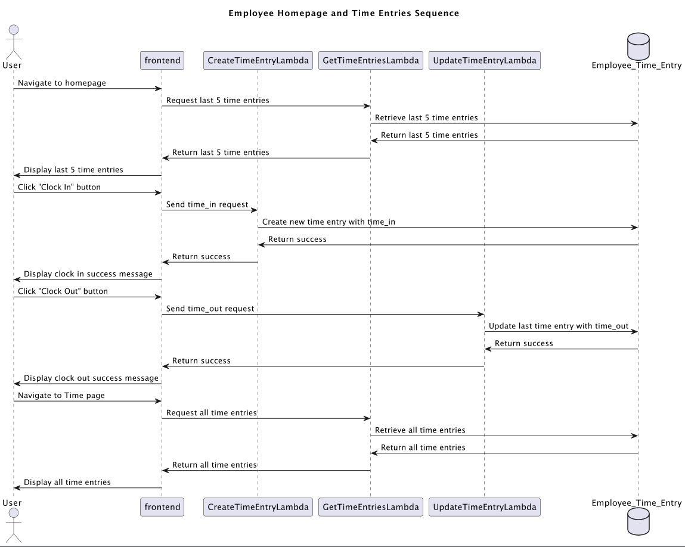
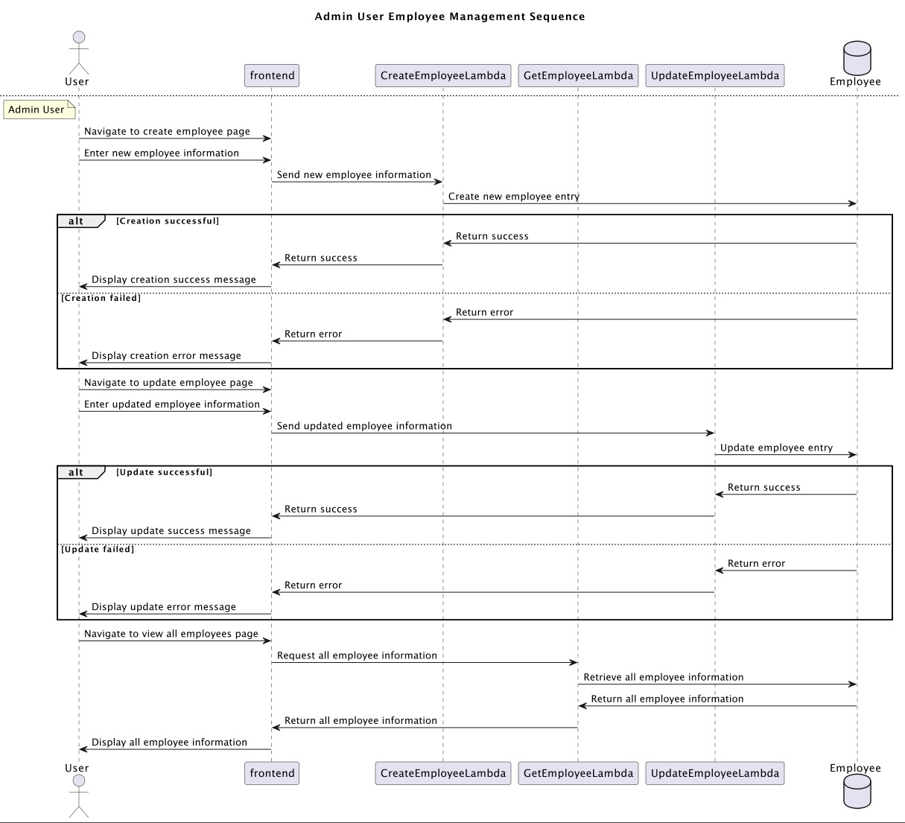
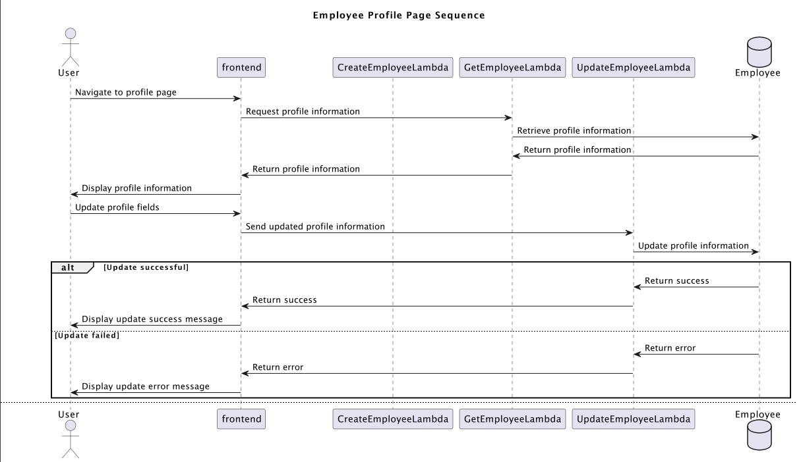
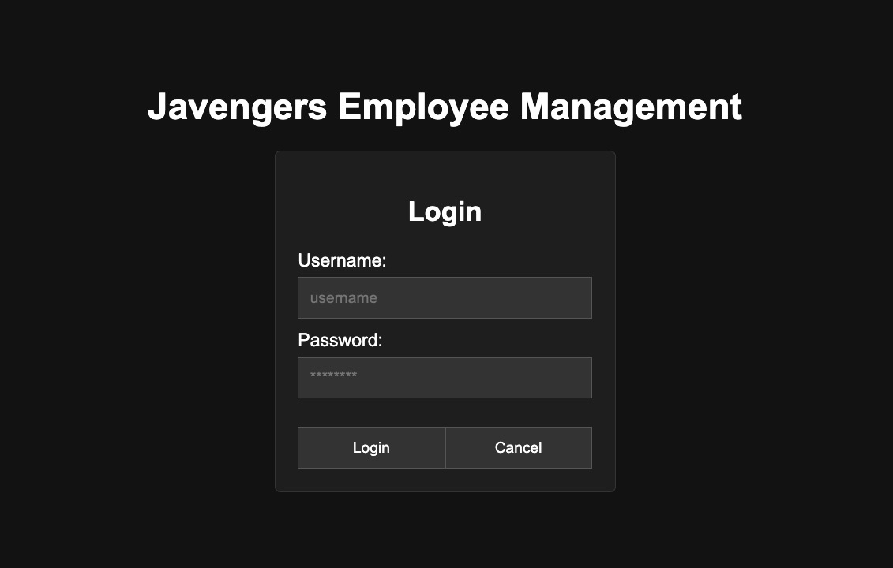
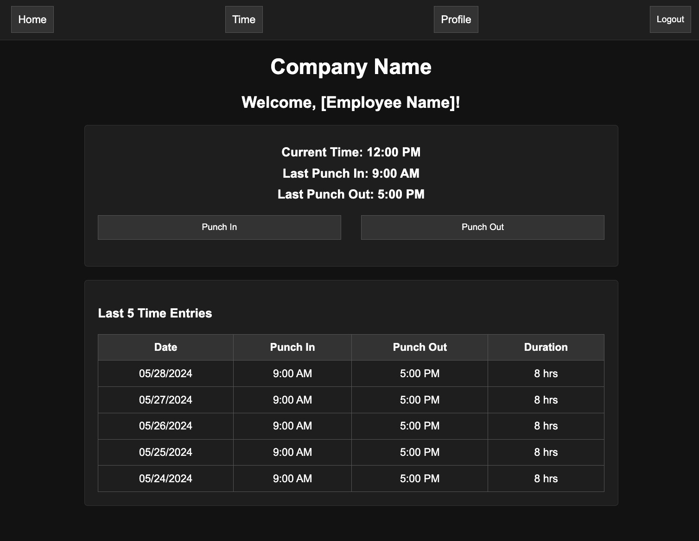
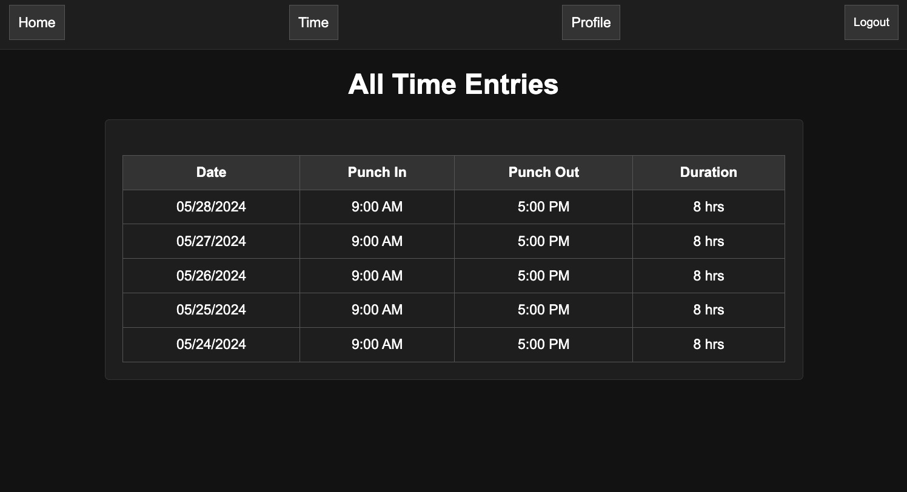
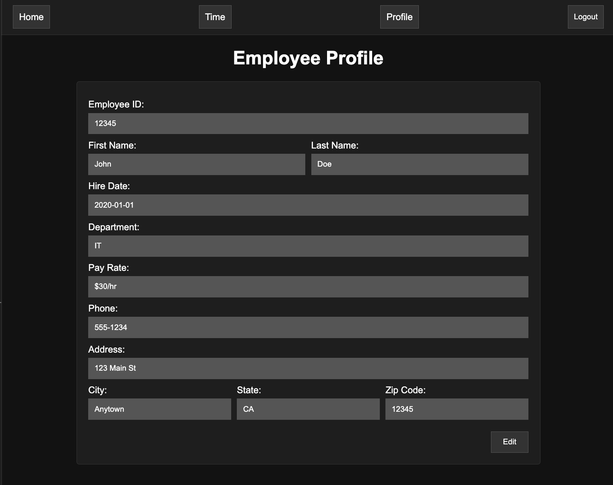

# Javengers Assemble Design Document

## *Employee Management App* Design

## 1. Problem Statement

Small businesses might not be able to afford multiple systems to manage employees, payroll, etc.
They need an affordable, integrated solution to manage employee time tracking and profiles efficiently.

## 2. Top Questions to Resolve in Review

1. How can we ensure secure authentication and authorization for different user roles (employees vs. admins)?
  - **Solution:** Using AWS Cognito to manage user credentials, authentication, and authorization.
2. What are the most efficient ways to handle data storage and retrieval in DynamoDB for our use cases?
3. How can we design a user-friendly interface that simplifies the process of punching in/out and managing employee records?

## 3. Use Cases

1. As an employee, I want to log in to the app to view and manage my work hours.
2. As an admin, I want to add new employees to the system to keep the employee database updated.
3. As an admin, I want to modify employee information to maintain accurate records.

## 4. Project Scope

### 4.1. In Scope

- User authentication and authorization using AWS Cognito
- Punch in/out functionality
- Employee profile management
- Admin functionalities (add/modify employees)

### 4.2. Out of Scope

- Integration with external payroll systems
- Advanced reporting features

# 5. Proposed Architecture Overview

- AWS Cognito for user authentication and authorization, managing user pools and tokens.
- AWS Lambda for serverless backend functions.
- DynamoDB for data storage.
- API Gateway to expose APIs and integrate with AWS Cognito for securing endpoints.
- A frontend framework like React for the web interface.

### Sequence Diagram

#### Timestamp Sequence

#### Employee Information

# 6. API

## 6.1. Public Models

- **EmployeeModel:** { employee_id, first_name, last_name, email, department, hire_date, currently_employed, terminated_date, phone, address, city, state, zip_code, pay_rate, permission_access }
- **EmployeeTimeEntryModel:** { employee_id, entry_id, time_in, time_out, duration }

## 6.2. Endpoints

### Authentication and Authorization

- **SignUp / SignIn / SignOut**
  - Handled by AWS Cognito. The frontend will interact with AWS Cognito for user registration, login, and logout.

### Employee_Time_Entry

- **GET /employee_time_entry**
  - **Description:** Retrieve all time entries for a given employee.
  - **Input:** { employee_id }
  - **Output:** List of time entries.
  - **Error Handling:** Employee not found, server errors.

- **GET /employee_time_entry/all**
  - **Description:** Retrieve all time entries for all employees (admin only).
  - **Input:** { }
  - **Output:** List of time entries.
  - **Error Handling:** Unauthorized access, server errors.

- **POST /employee_time_entry**
  - **Description:** Create a new time_in timestamp.
  - **Input:** { employee_id, time_in }
  - **Output:** { success, data (new time entry) }
  - **Error Handling:** Employee not found, server errors.

- **PUT /employee_time_entry**
  - **Description:** Update the time_out timestamp for the last time entry.
  - **Input:** { employee_id, time_out }
  - **Output:** { success, data (updated time entry) }
  - **Error Handling:** Employee not found, no active time entry, server errors.

- **DELETE /employee_time_entry**
  - **Description:** Delete an employee's time entry (admin only).
  - **Input:** { employee_id, entry_id }
  - **Output:** { success }
  - **Error Handling:** Employee or entry not found, unauthorized access, server errors.

### Employee

- **GET /employee**
  - **Description:** Retrieve single employee information.
  - **Input:** { employee_id }
  - **Output:** Employee details.
  - **Error Handling:** Employee not found, server errors.

- **GET /employee/all**
  - **Description:** Retrieve all employees' information (admin only).
  - **Input:** { }
  - **Output:** List of employees.
  - **Error Handling:** Unauthorized access, server errors.

- **POST /employee**
  - **Description:** Create a new employee (admin only).
  - **Input:** { employee_id, first_name, last_name, email, department, hire_date, currently_employed, terminated_date, phone, address, city, state, zip_code, pay_rate, permission_access }
  - **Output:** { success, data (new employee) }
  - **Error Handling:** Employee already exists, server errors.

- **PUT /employee**
  - **Description:** Update select fields by non-admin employee.
  - **Input:** { employee_id, phone, address, city, state, zip_code }
  - **Output:** { success, data (updated employee) }
  - **Error Handling:** Employee not found, unauthorized access, server errors.

- **PUT /employee/admin**
  - **Description:** Update any field (admin only).
  - **Input:** { employee_id, first_name, last_name, email, department, hire_date, currently_employed, terminated_date, phone, address, city, state, zip_code, pay_rate, permission_access }
  - **Output:** { success, data (updated employee) }
  - **Error Handling:** Employee not found, unauthorized access, server errors.

# 7. Tables

**Employee:**

- **Partition Key:** employee_id (String)
- **Sort Key:** last_name (String)
- first_name (String)
- email (String)
- hire_date (String)
- currently_employed (Boolean)
- terminated_date (String)
- department (String)
- phone (String)
- address (String)
- city (String)
- state (String)
- zip_code (String)
- pay_rate (Number)
- permission_access (String)

**Employee_Time_Entry:**

- **Partition Key:** employee_id (String)
- **Sort Key:** entry_id (String)
- time_in (String)
- time_out (String)
- duration (Number)

# 8. Pages
#### Login Page

#### Homepage

#### Time Page

#### Profile Page

